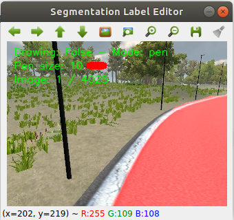

# Binary Image Labeling Tool



## Environment

- Use Anaconda's OpenCV or any OpenCV version supporting Qt.

```
conda install -c conda-forge opencv
```

## How to use?

- Put images in folder `image` and raw labels in `image_gt`.

- Image and corresponding label should have a same name.

- Run the labeling tool:

```
python labeling.py -i './image/' -l './image_gt/'
```

- Instruction: 

```
Pen: w; Eraser: e; Magic: m; Undo Magic: n; Line: t
Save: s; Reload: r; 
+Pensize: z; -Pensize: x; 
Next image: f
Previous image: d
```